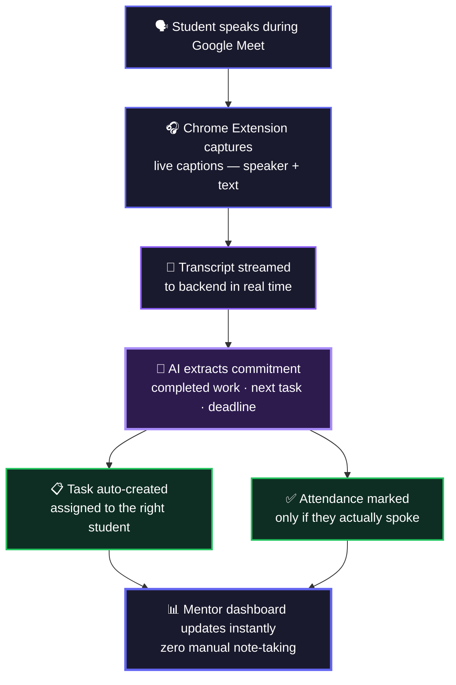
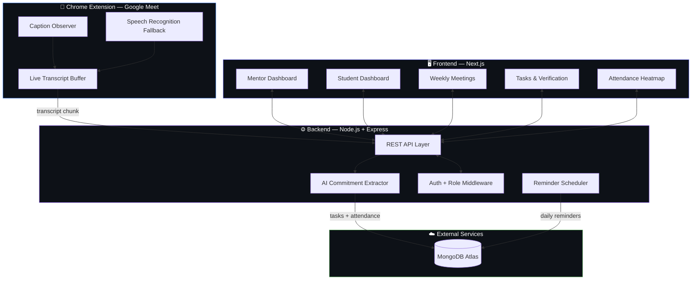
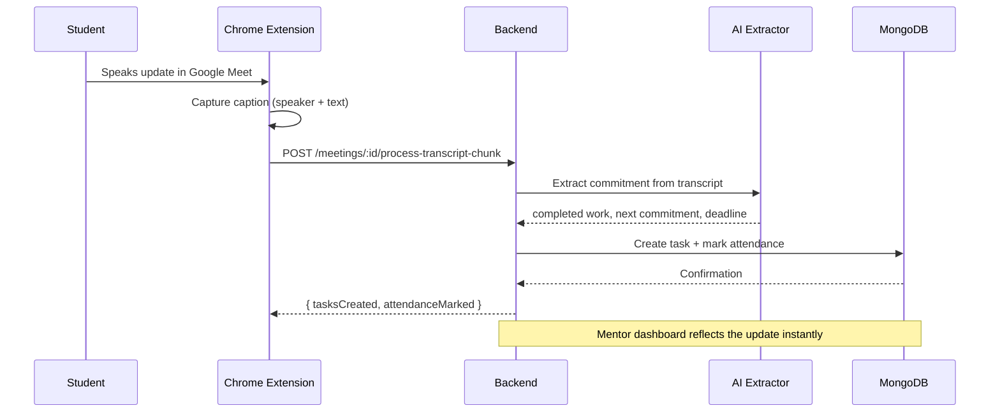

<div align="center">


# MeetingMind

### AI-Powered Mentor Accountability & Meeting Intelligence Platform

[](https://meetingmind-frontend-45d3.onrender.com)

<br/>


</div>

---

## 🚨 The Problem

A mentor managing 100–300 students across weekly sync calls ends up spending more time on **operational bookkeeping** than actual mentoring:

- Manually transcribing who said what, in an Excel sheet, live, during the call
- Guessing whether "joined the call" actually means "gave a real update"
- Remembering last week's commitments to check them against this week's
- Chasing daily updates, leave requests, and reminders by hand

None of this scales past a handful of people — and it's exactly the kind of repetitive tracking work that shouldn't need a human doing it in real time.

**MeetingMind removes the bookkeeping so mentors can focus on mentoring.**

---

## 💡 What MeetingMind Does

### Core Innovation: Live Meeting → Structured Accountability, Automatically



Attendance in MeetingMind isn't "did you join the call" — it's **"did you actually give a spoken update."** Silent attendees are marked absent, exactly like a real mentor would judge it.

---

## 🧩 Features

| Feature | Description |
|---|---|
| 🎙 **Live Meet Transcript Capture** | Chrome extension listens to Google Meet captions per-speaker, in real time, with a Speech Recognition fallback |
| 🤖 **AI Commitment Extraction** | Turns raw spoken updates into structured "completed work" + "next commitment" + deadline |
| ✅ **Real Attendance Logic** | Marks presence only on a genuine spoken update — not just joining the call |
| 📋 **Auto-Generated Tasks** | Every commitment becomes a trackable task, assigned to the right student automatically |
| 🔁 **Maker–Checker Task Verification** | Students mark work done → mentor verifies → prevents false self-reporting |
| ⏰ **Automated Daily Reminders** | Nudges students who haven't logged a daily update by a set time |
| 📅 **Meeting Scheduling & Confirmation** | Mentor confirms weekly syncs, reminders go out automatically |
| 🌴 **Structured Leave Requests** | Replaces ad-hoc WhatsApp messages with a trackable approve/reject workflow |
| 🏢 **Workspace Isolation** | Multiple mentors, multiple cohorts, fully separated — students only see their own workspace |
| 🔐 **Role-Based Access Control** | Mentors see the full team; students see only their own tasks, attendance, and history |
| 📊 **Engagement Analytics** | Heatmaps and per-student trends to catch disengagement before it becomes a pattern |
| 🗂 **Permanent Meeting Archive** | Every transcript, commitment, and verification stored for full historical review |

---

## 🏗 System Architecture



### Live Transcript → Task Pipeline



---

## 🔐 Access Control Design

MeetingMind separates mentor and student views at both the **UI and API level** — not just hidden menu items:

- **Mentors / Admins** — full workspace visibility: all students' tasks, attendance, leave requests, meeting scheduling, transcript processing, team management, and analytics
- **Students** — scoped strictly to their own data: their tasks, their attendance record, their leave requests, their meeting history — no visibility into other students or workspace-wide controls
- Role checks are enforced in the sidebar (so students never see admin-only navigation), the page level (direct URL access to an admin route redirects to the dashboard), and are designed to be enforced again at the API layer so scoping can't be bypassed by a direct request

---

## 🛠 Tech Stack

**Backend**
- Node.js + Express
- MongoDB Atlas — persistence
- JWT-based auth with Google OAuth
- AI-powered transcript-to-commitment extraction

**Frontend**
- Next.js (App Router)
- Tailwind CSS
- Framer Motion for UI transitions

**Chrome Extension**
- Manifest V3 service worker
- MutationObserver-based live caption capture
- Web Speech API fallback for redundancy

**Deployment**
- Backend → Render
- Frontend → Render
- Database → MongoDB Atlas

---

## 🌐 Live Demo

🔗 **[meetingmind-frontend-45d3.onrender.com](https://meetingmind-frontend-45d3.onrender.com)**

---

## 💻 Local Setup

### Backend
```bash
cd backend
npm install
cp .env.example .env
node server.js
```

### Frontend
```bash
cd app
npm install
npm run dev
```

### Chrome Extension
```bash
1. Open chrome://extensions
2. Enable Developer Mode
3. Click "Load unpacked" and select the /extension folder
4. Join a Google Meet call and click "Start Listening"
```

---

<div align="center">

*Turning spoken commitments into tracked accountability — automatically.*

</div>