<div align="center">


# MeetingMind

### AI-Powered Mentor Accountability & Meeting Intelligence Platform

[](https://meetingmind-navy.vercel.app)

<br/>


<br/>

*A full end-to-end system spanning a Chrome extension, a Node/Express API, an AI extraction pipeline, and a Next.js dashboard — built and hardened through real production debugging, not a tutorial checklist.*

</div>

---

## 🚨 The Problem

A mentor managing 100–300 students across weekly sync calls ends up spending more time on **operational bookkeeping** than actual mentoring:

- Manually transcribing who said what, in an Excel sheet, live, during the call
- Guessing whether "joined the call" actually means "gave a real update"
- Remembering last week's commitments to check them against this week's
- Chasing daily updates, leave requests, and reminders by hand

None of this scales past a handful of people — and it's exactly the kind of repetitive tracking work that shouldn't need a human doing it in real time.

**MeetingMind removes the bookkeeping so mentors can focus on mentoring.**

---

## 💡 What MeetingMind Does

### Core Innovation: Live Meeting → Structured Accountability, Automatically

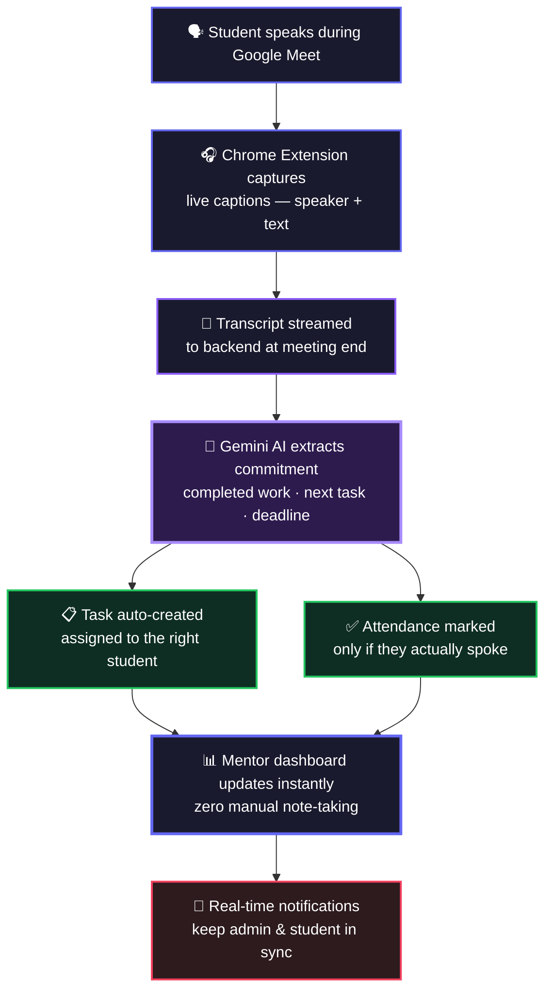

Attendance in MeetingMind isn't "did you join the call" — it's **"did you actually give a spoken update."** Silent attendees are marked absent, exactly like a real mentor would judge it.

---

## 📸 Product Walkthrough

<div align="center">

<table>
<tr>
<td width="50%">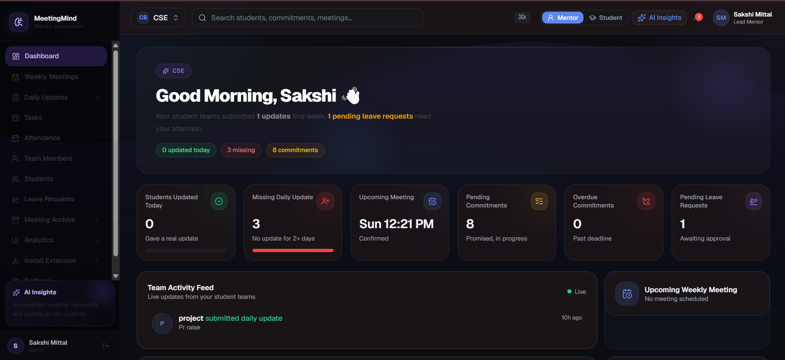<br/><sub><b>Mentor Dashboard</b> — live team activity, pending approvals, upcoming syncs</sub></td>
<td width="50%">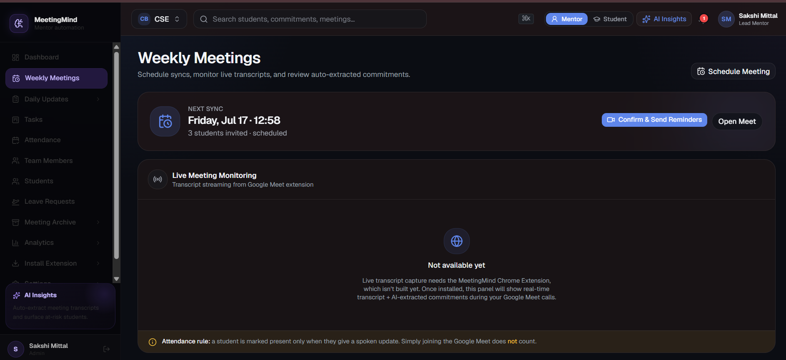<br/><sub><b>Weekly Meetings</b> — schedule, confirm, and monitor live transcript capture</sub></td>
</tr>
<tr>
<td width="50%">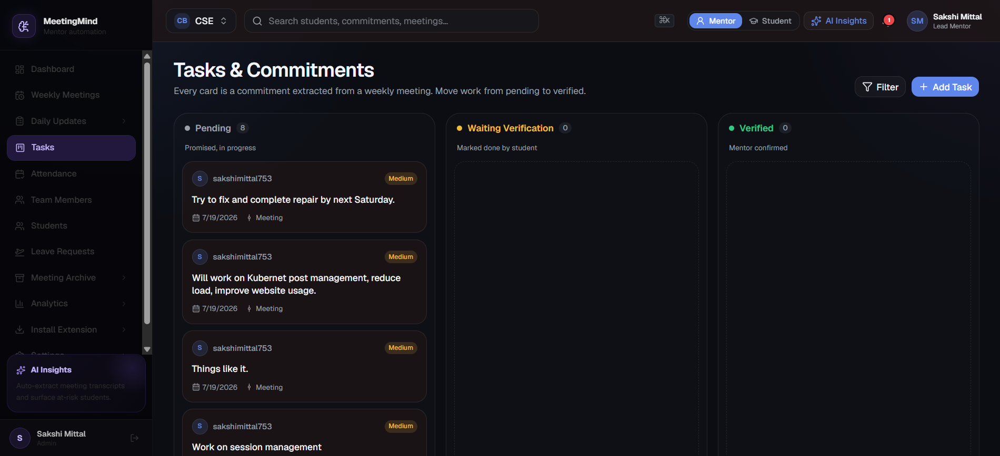<br/><sub><b>Tasks & Commitments</b> — Kanban board auto-populated from meeting transcripts</sub></td>
<td width="50%">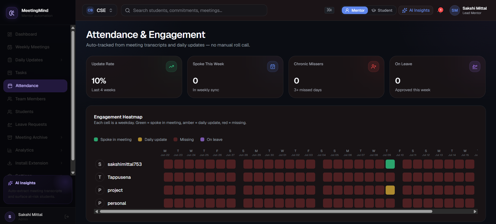<br/><sub><b>Attendance & Engagement</b> — 7-day heatmap, spoke-in-meeting logic</sub></td>
</tr>
<tr>
<td width="50%">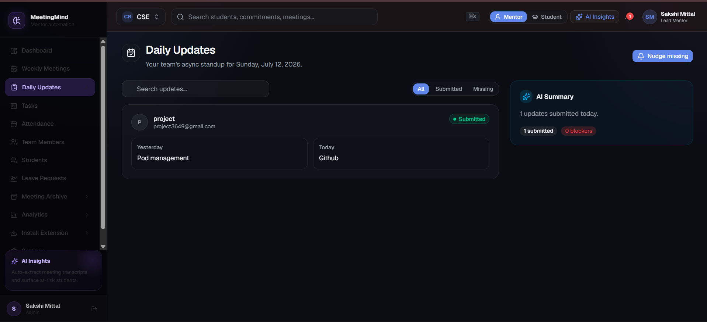<br/><sub><b>Daily Updates</b> — async standups with AI-generated summaries</sub></td>
<td width="50%">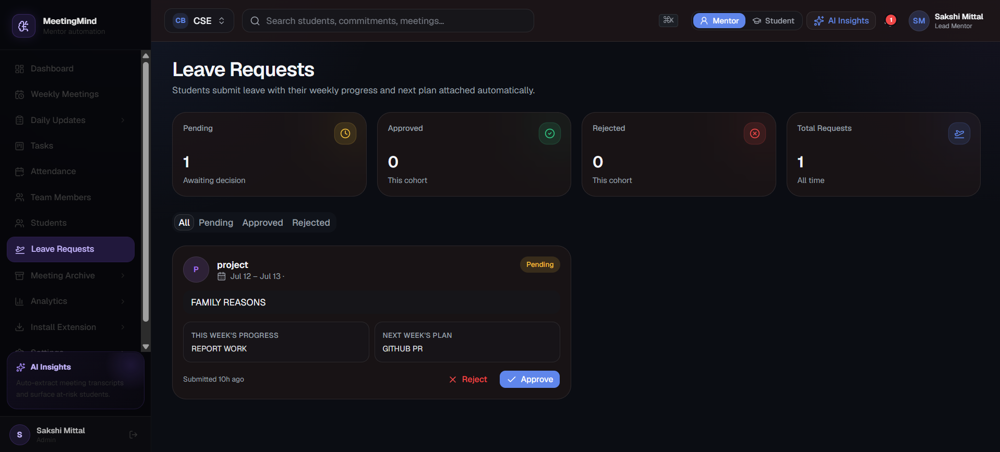<br/><sub><b>Leave Requests</b> — structured approve/reject workflow</sub></td>
</tr>
<tr>
<td width="50%">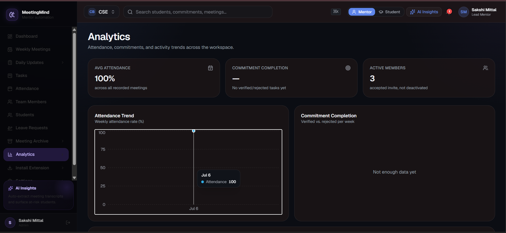<br/><sub><b>Analytics</b> — attendance trends, commitment completion rate</sub></td>
<td width="50%">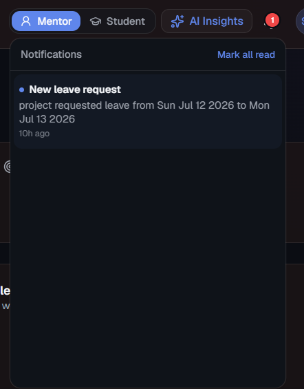<br/><sub><b>Real-time Notifications</b> — admin ↔ student stay in sync instantly</sub></td>
</tr>
</table>

</div>

---

## 🧠 Engineering Challenges Solved

Building the live-transcript pipeline surfaced a set of real distributed-systems and browser-platform problems — not just CRUD plumbing:

<table>
<tr>
<td width="30%"><b>🎯 Speaker attribution vs. AI over-matching</b></td>
<td>The commitment-extraction model was fuzzy-matching partially-overlapping names (e.g. an admin's name being substring-matched into a similarly-named student), silently misattributing every commitment to one account. Fixed by tightening the extension's local speaker-resolution to exact normalized matches only, and excluding the current user's own video tile from active-speaker detection — rather than trusting either the DOM or the model's fuzzy logic in isolation.</td>
</tr>
<tr>
<td><b>⏱ Chrome extension popup race condition</b></td>
<td>Recording state was being persisted <i>after</i> the async token-refresh chain resolved — meaning closing the popup mid-flow (a near-guarantee on a real Meet call) meant the UI silently reset on reopen even though recording was still active in the background. Fixed by persisting state optimistically at the moment of user action, with rollback on failure.</td>
</tr>
<tr>
<td><b>💸 Third-party API quota exhaustion</b></td>
<td>Streaming a transcript chunk to the LLM every 60 seconds blew through the free-tier daily request quota well before a single day of testing finished. Redesigned the pipeline to batch and send once per meeting instead of per interval — cutting API calls by roughly 10–15x with no loss of extraction quality.</td>
</tr>
<tr>
<td><b>📅 Silent data-loss on weekends</b></td>
<td>The attendance heatmap generated a hardcoded 5-day work week, meaning any Saturday/Sunday activity had no cell to render into at all — data was being recorded correctly but was structurally invisible. Fixed at the date-generation layer rather than papering over it in the UI.</td>
</tr>
<tr>
<td><b>🔔 Dead UI vs. real state</b></td>
<td>A notification bell existed in the design with a permanently-on unread indicator and no backing data — a common trap where UI ships ahead of the system that's supposed to drive it. Replaced with a real <code>Notification</code> collection, workspace-scoped API, and trigger hooks wired into every state-changing action (leave review, task verification, meeting confirmation) across three separate controllers.</td>
</tr>
</table>

---

## 🧩 Features

| Feature | Description |
|---|---|
| 🎙 **Live Meet Transcript Capture** | Chrome extension listens to Google Meet captions per-speaker, with a Speech Recognition fallback |
| 🤖 **AI Commitment Extraction** | Gemini turns raw spoken updates into structured "completed work" + "next commitment" + deadline |
| ✅ **Real Attendance Logic** | Marks presence only on a genuine spoken update — not just joining the call |
| 📋 **Auto-Generated Tasks** | Every commitment becomes a trackable task, assigned to the right student automatically |
| 🔁 **Maker–Checker Task Verification** | Students mark work done → mentor verifies → prevents false self-reporting |
| 🔔 **Real-Time Notifications** | Leave requests, task verifications, and meeting updates instantly notify the other side — in-app, not just email |
| ⏰ **Automated Daily Reminders** | Nudges students who haven't logged a daily update by a set time |
| 📅 **Meeting Scheduling & Confirmation** | Mentor confirms weekly syncs, reminders go out automatically |
| 🌴 **Structured Leave Requests** | Replaces ad-hoc WhatsApp messages with a trackable approve/reject workflow |
| 🏢 **Workspace Isolation** | Multiple mentors, multiple cohorts, fully separated — students only see their own workspace |
| 🔐 **Role-Based Access Control** | Mentors see the full team; students see only their own tasks, attendance, and history |
| 📊 **Engagement Analytics** | Heatmaps and per-student trends to catch disengagement before it becomes a pattern |
| 🗂 **Permanent Meeting Archive** | Every transcript, commitment, and verification stored for full historical review |

---

## 🏗 System Architecture

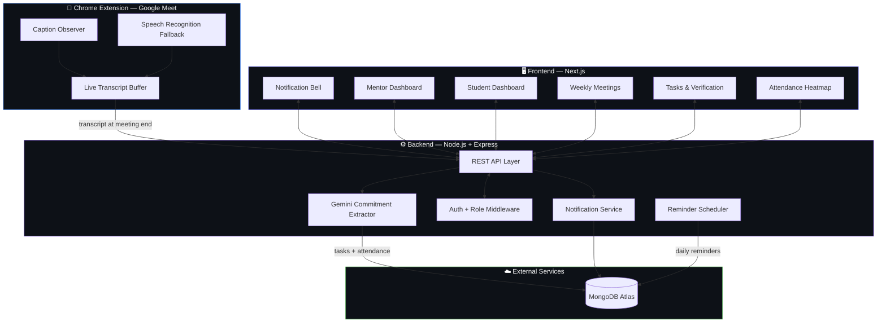

### Live Transcript → Task Pipeline

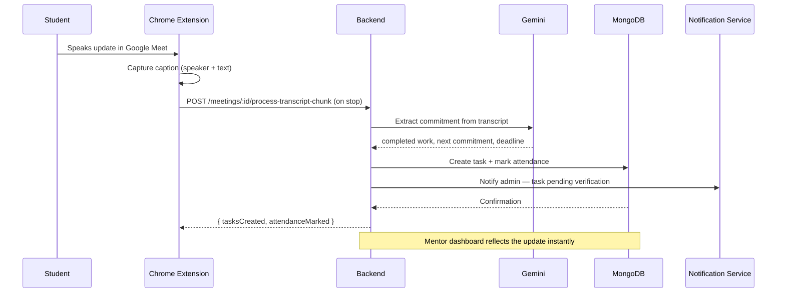

---

## 🔐 Access Control Design

MeetingMind separates mentor and student views at both the **UI and API level** — not just hidden menu items:

- **Mentors / Admins** — full workspace visibility: all students' tasks, attendance, leave requests, meeting scheduling, transcript processing, team management, and analytics
- **Students** — scoped strictly to their own data: their tasks, their attendance record, their leave requests, their meeting history — no visibility into other students or workspace-wide controls
- Role checks are enforced in the sidebar (so students never see admin-only navigation), the page level (direct URL access to an admin route redirects to the dashboard), and are enforced again at the API layer so scoping can't be bypassed by a direct request

---

## 🛠 Tech Stack

**Backend**
- Node.js + Express + TypeScript
- MongoDB Atlas — persistence
- JWT-based auth with Google OAuth
- Google Gemini — transcript-to-commitment extraction
- Nodemailer — transactional email

**Frontend**
- Next.js (App Router)
- Tailwind CSS
- Framer Motion for UI transitions

**Chrome Extension**
- Manifest V3 service worker
- MutationObserver-based live caption capture
- Web Speech API fallback for redundancy

**Deployment**
- Backend → Railway
- Frontend → Vercel
- Database → MongoDB Atlas

---

## 🌐 Live Demo

🔗 **[meetingmind-navy.vercel.app](https://meetingmind-navy.vercel.app)**

---

## 💻 Local Setup

### Backend
```bash
cd backend
npm install
cp .env.example .env
npm run build && npm start
```

### Frontend
```bash
cd app
npm install
npm run dev
```

### Chrome Extension
```bash
1. Open chrome://extensions
2. Enable Developer Mode
3. Click "Load unpacked" and select the /extension folder
4. Join a Google Meet call, open the extension, log in as admin, and click "Start Listening"
```

---

<div align="center">

*Turning spoken commitments into tracked accountability — automatically.*

</div>